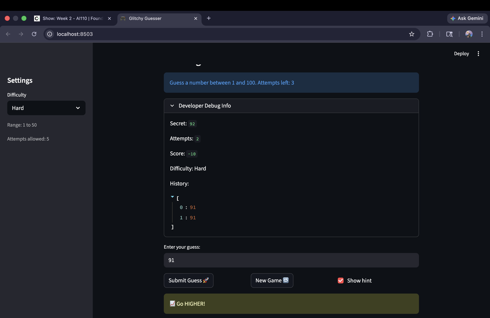

# 🎮 Game Glitch Investigator: The Impossible Guesser

## 🚨 The Situation

You asked an AI to build a simple "Number Guessing Game" using Streamlit.
It wrote the code, ran away, and now the game is unplayable. 

- You can't win.
- The hints lie to you.
- The secret number seems to have commitment issues.

## 🛠️ Setup

1. Install dependencies: `pip install -r requirements.txt`
2. Run the broken app: `python -m streamlit run app.py`

## 🕵️‍♂️ Your Mission

1. **Play the game.** Open the "Developer Debug Info" tab in the app to see the secret number. Try to win.
2. **Find the State Bug.** Why does the secret number change every time you click "Submit"? Ask ChatGPT: *"How do I keep a variable from resetting in Streamlit when I click a button?"*
3. **Fix the Logic.** The hints ("Higher/Lower") are wrong. Fix them.
4. **Refactor & Test.** - Move the logic into `logic_utils.py`.
   - Run `pytest` in your terminal.
   - Keep fixing until all tests pass!

## 📝 Document Your Experience

- [ ] Describe the game's purpose. The games purpose is to guess a number. You are given a specific number of attempts and hints at 3 different levels, easy normal and hard.
- [ ] Detail which bugs you found.
1. Hints across all levels
Expected: give the correct hint to go lower or higher based on a comparision of guess vs secret. -> fix 1 
Actual: Hints were outright wrong and in most cases were the oppposite of the correct hint.

2. Range and number of attempts for Hard 
Expected: According to the nature of the level, hard should have a larger range than easy and normal.
Actual: Hard only tries 1 to 50. The number of attempts though is appropriately capped to 5.

3. New game button across all levels
Exected: Start a new game with a new game history block
Actual: The button fails to start a new game with a new history block.

4. Number of attempts across all levels -> fix 2 
Expected: Number of attempts match the suggested number of attempts
Actual: The attempts allowed are one short of the suggested attempts.

5. Submit button across all levels 
Expected: submit a guess on clicking
Actual: button works only on 2 clicks after the first attempt.

- [ ] Explain what fixes you applied.

Fixed the the following 2 bugs:

1. Hints across all levels
Expected: give the correct hint to go lower or higher based on a comparision of guess vs secret. -> fix 1 
Actual: Hints were outright wrong and in most cases were the oppposite of the correct hint

2. Number of attempts across all levels -> fix 2 
Expected: Number of attempts match the suggested number of attempts
Actual: The attempts allowed are one short of the suggested attempts.

## 📸 Demo

- [ ] [Insert a screenshot of your fixed, winning game here]

## 🚀 Stretch Features

- [ ] [If you choose to complete Challenge 4, insert a screenshot of your Enhanced Game UI here]
